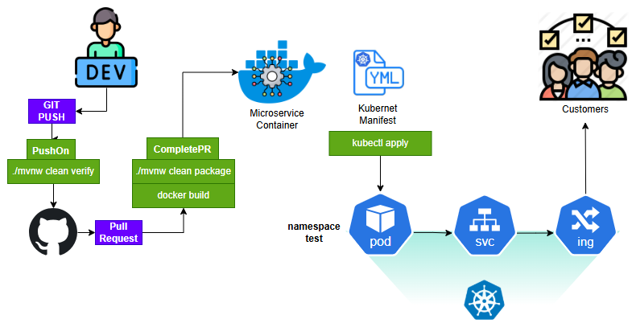

# TechnicalExercise-DevOpsEngineer
Design and implement a minimal yet complete workflow for deploying a microservice


## Como se realizo la solucion

Para realizar el microservicio se decidio escoger una solucion basada en Java Spring Boot, debido a que es el standard para implementaciones empresariales y por la robustes en automatizacion del despliegue, fiabilidad, escalabilidad, monitoreo y seguridad.

Se decidio utilizaran las siguientes dependencias:
1. Spring Boot Starter Web
2. Spring Boot Starter Test
3. Spring Boot Actuator

Con estas dependencia vamos a poder lograr implementar lo requerido la respuesta de:
1. implementacion de endpoint `/health`
2. ejecucion de pruebas unitarias
3. posibilidad de capturar las metricas `GET /actuator/metrics` y `GET /actuator/health`
4. se crea archivo logback para que emita un json por defecto y se pueda capturar con ELK o CloudWatch
5. se le crea una capa de metricas `/actuator/prometheus` esto permite integrarlo con Prometheus o Grafana

## Especificaciones de la APP

Se configura para que solo responda un `OK` al visitar /health sobre el puerto 8080 del localhost
```Bash
public class HealthController {

    @GetMapping("/health")
    public String health() {
        return "OK";
    }
}
```

Se configura tambien para que devuelva un status para su monitoreo y una ruta que devuelven los valores requeridos para obtener mas informacion del microservicio

## Metodología y Automatización CI/CD

El modelo de ramas (branch model) se basa en un flujo Git estándar, manteniendo una estructura clara de versiones y responsabilidades:

- **master** : rama principal de producción.
- **sprints** : rama de seguimiento de desarrollo en equipo.
- **features** : ramas individuales para desarrollo de historias de usuario.
- **hotfix** : ramas dedicadas a correcciones urgentes en ambientes productivos.


Fueron creados dos archivos YAML dentro del directorio de workflows de GitHub Actions que automatizan las validaciones y despliegues:

- **PushOn.yml** :  
  Se ejecuta automáticamente al realizar un `git push` hacia ramas `feature/*` o `hotfix/*`.  
  Este pipeline realiza compilación y ejecución de pruebas unitarias (`mvn clean verify`).  
  Si las pruebas pasan exitosamente, el push se completa; en caso contrario, el flujo se detiene marcando el error en GitHub.

- **CompletePR.yml** :  
  Se ejecuta al crear un Pull Request hacia la rama `de sprint`.  
  Este pipeline realiza un proceso de integración completo que incluye:
  - **Checkout** del código.
  - **Compilación y pruebas unitarias** (`mvn clean package`).
  - **Construcción de la imagen Docker** (`docker build`).
  - **Aplicación de manifiestos Kubernetes** en un *namespace* de prueba (`kubectl apply`).

### Flujo general del pipeline

1. **Developer / Git**
   - El desarrollador realiza cambios en el proyecto.
   - Ejecuta `git push` hacia una rama `feature/...` o `hotfix/...`.

2. **GitHub Actions – PushOn.yml**
   - Se dispara el workflow ligero.
   - Ejecuta `./mvnw clean verify`.
   - Si pasa: el código se integra en el repositorio.
   - Si falla: el push queda bloqueado con un check rojo.

3. **Pull Request → `feature` y `hotfix`**
   - Se crea un Pull Request desde `feature/...` o `hotfix/...` hacia `main`.

4. **GitHub Actions – CompletePR.yml**
   - Se dispara el workflow completo.
   - Realiza compilación, test, construcción de la imagen Docker y (si está configurado) despliegue al ambiente de prueba.

5. **Kubernetes (ambiente de prueba)**
   - El `Deployment` se actualiza con la nueva imagen.
   - Se crea o actualiza el `Pod` que contiene el microservicio Spring Boot.
   - El `Service` interno de Kubernetes expone el pod dentro del cluster.
   - El `Ingress` permite el acceso HTTP externo al microservicio.
   - Prometheus y ELK recolectan métricas y logs estructurados para observabilidad.

Este flujo permite validar continuamente la calidad del código, mantener la trazabilidad entre ramas y asegurar la entrega automatizada hacia entornos controlados de prueba.

6. **Despliegues a ambientes altos**
  - Se realizan a partir de un JOB donde se selecciona el tag y version incorporado por un Pull Request en la rama `main`

  Ambos pipelines en conjunto (PushOn.yml y CompletePR.yml) aseguran que:
  - Los commits solo se integran si superan las pruebas.
  - Los Pull Requests generan builds reproducibles y verificables en Kubernetes.
  - La calidad y estabilidad del código se mantienen antes de llegar a producción.

## Diagrama de la solucion




