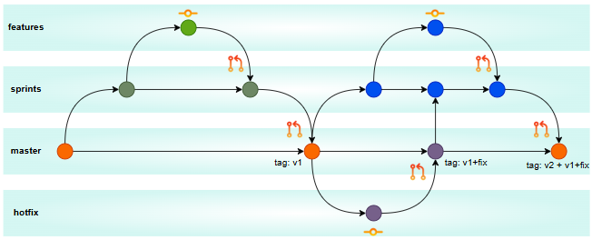

# TechnicalExercise-DevOpsEngineer
design and implement a minimal yet complete workflow for deploying a microservice


## Como se realizo la solucion

Para realizar el microservicio se decidio escoger una solucion basada en Java Spring Boot, debido a que es el standard para implementaciones empresariales y por la robustes en automatizacion del despliegue, fiabilidad, escalabilidad, monitoreo y seguridad.

Se decidio utilizaran las siguientes dependencias:
1. Spring Boot Starter Web
2. Spring Boot Starter Test
3. Spring Boot Actuator

Con estas dependencia vamos a poder lograr implementar lo requerido la respuesta de:
1. implementacion de endpoint /health
2. ejecucion de pruebas unitarias
3. posibilidad de capturar las metricas GET /actuator/metrics y GET /actuator/health

## Especificaciones de la APP

Se configura para que solo responda un 'OK' al visitar /health sobre el puerto 8080 del localhost
```Bash
public class HealthController {

    @GetMapping("/health")
    public String health() {
        return "OK";
    }
}
```

Se configura tambien para que devuelva un status para su monitoreo y una ruta que devuelven los valores requeridos para obtener mas informacion del microservicio

## Metodologia y Automatizacion CI/CD

El branch model a utilizar se basara en el workflow git standard que conocemos
tendremos las ramas:
- **master** : rama principal
- **sprints** : rama de seguimiento de desarrollo para trabajo en equipo
- **features** : ramas de historias
- **hotfix** : ramas que identifican una reparacion inmediata en el ambiente de produccion




Fueron creados dos archivos YML dentro del repositorio de workflows de Github que realizan las siguientes funciones
- **PushOn** : Al momento que el desarrollador ejecute la accion de push hacia el repositorio este se activara realizando primero las pruebas y validacion del componente si este no pasa las pruebas no se completa la funcion de push en el repositorio.
- **CompletePR** : Se realiza el PR para la revision y aprobacion del cambio, cuando este se encuentra revisado al momento de su aceptacion se ejecuta la accion de despliegue en el ambiente de prueba.
- **Jobs** : Se crean jobs directos para el despliegue hacia ambientes altos como UAT, STAGE y PROD

